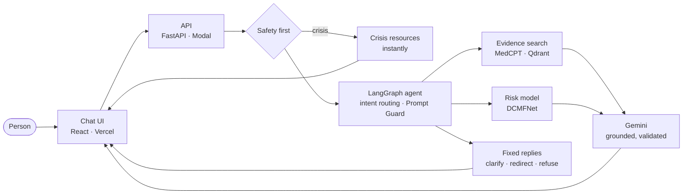
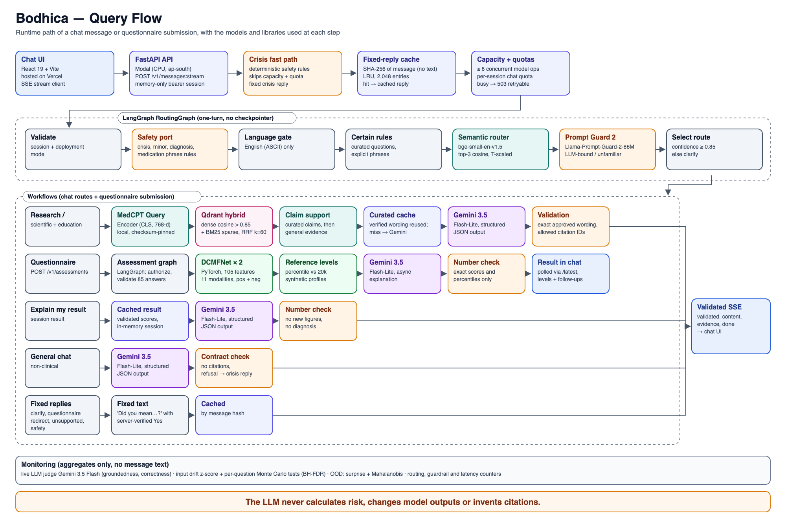
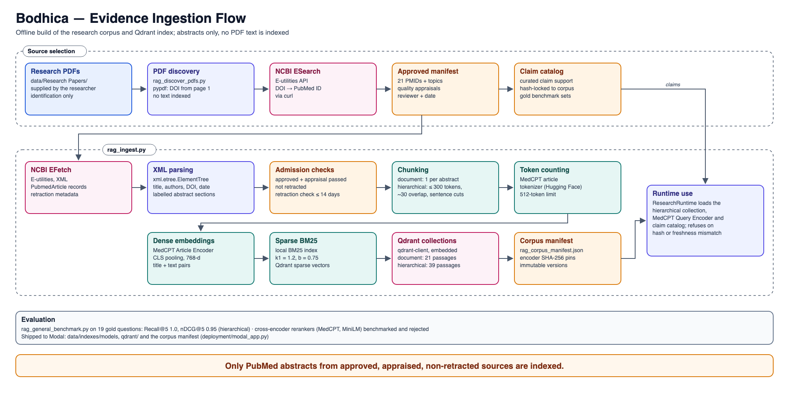

# Bodhica

**A research assistant that reads the science, runs the model, and knows where its knowledge ends.**

Ask Bodhica whether childhood bullying is linked to later substance use, and it answers from appraised PubMed studies, citing the exact passages it relied on. Fill in its questionnaire, and a multimodal deep-learning model estimates where your profile sits for psychotic, manic and depressive symptom patterns. Gemini then explains what that position means, in plain language, without being allowed to change a single number. Say something that suggests you are in crisis, and every model is skipped: you get help resources at once, even if the service is busy.

> Bodhica is a research demonstration built on synthetic training data. It is not a diagnosis, medical advice or an emergency service.

## What it does

|                                |                                                                                                                                                                                        |
| ------------------------------ | -------------------------------------------------------------------------------------------------------------------------------------------------------------------------------------- |
| **Answers research questions** | Hybrid search over appraised PubMed abstracts, answered by Gemini with citations that must match the retrieved evidence exactly.                                                       |
| **Estimates symptom risk**     | An 85-question questionnaire feeds DCMFNet, a PyTorch multimodal fusion model. Each score is placed against a 20,000-profile reference group and explained in the chat.                |
| **Knows when to stop**         | Crisis messages get help resources before any model runs. Diagnosis requests, medication questions and prompt-injection attempts are designed to be refused before they reach the LLM. |
| **Watches itself**             | Live monitoring of input drift, unusual submissions, answer quality and latency, without storing a single message.                                                                     |

## High-level architecture

Three ideas shape the design:

- **Deterministic before generative.** Safety rules, routing and the risk model decide what happens. The LLM only explains results and evidence it is given, and every reply is checked before you see it.
- **Evidence you can trace.** Research answers cite specific PubMed passages, and curated claims must reproduce approved wording exactly.
- **Nothing to leak.** Sessions live in memory only. Monitoring keeps counts and scores, never message text or questionnaire answers.

## Low-level architecture

**Query flow:** every step a chat message or questionnaire submission passes through, with the model or library at each one.

**Evidence ingestion flow:** how approved PubMed abstracts become the searchable research corpus.

## By the numbers

| Area                   | Result                                                                                                   |
| ---------------------- | -------------------------------------------------------------------------------------------------------- |
| Research retrieval     | Recall@5 1.0 and nDCG@5 0.95 on 19 gold questions over 21 PubMed sources                                 |
| Intent routing         | 26% → 86% accuracy on a held-out test set after replacing regex rules with a calibrated embedding router |
| Prompt-injection guard | 0 of 90 normal messages blocked; 6 of 8 attacks caught (Llama Prompt Guard 2)                            |
| Drift monitoring       | False alarms cut from 70% to 2% at 30 submissions with sequential, sample-size-aware tests               |
| Latency                | 2.6× throughput (local load test, LLM excluded) after scoped guarding and caching                        |

Each figure comes from a documented benchmark or simulation, with its limits, in `[agent_docs/](agent_docs/)`. Models and tools that were evaluated and rejected (cross-encoder rerankers, Llama Guard, Monte Carlo dropout) are recorded in the [architecture decisions](agent_docs/ARCHITECTURE_DECISIONS.md).

## Built with

Python · PyTorch · LangGraph · FastAPI · Qdrant · Hugging Face Transformers (MedCPT, bge-small, Llama Prompt Guard 2) · Gemini · React + Vite · Vercel · Modal

## Explore further

- **Run it locally:** [developer guide](src/README.md)
- **Why it is built this way:** [architecture decisions](agent_docs/ARCHITECTURE_DECISIONS.md) and [approved AI architecture](agent_docs/APPROVED_AI_ARCHITECTURE.md)
- **How it is measured:** [evaluation and monitoring](agent_docs/BODHICA_EVALUATION_MONITOR.md)

