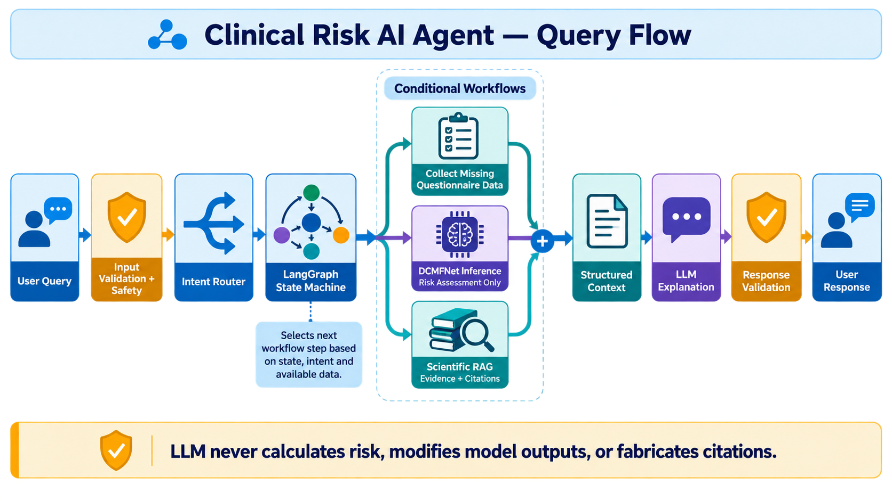

# Proposed AI Architecture

Status: Proposal for product clarification and AI Architect review; not approved for implementation

Owner: AI Architect

Date: 2026-08-17

Sources: [`Problem Statement.md`](../Problem%20Statement.md), [`AI_ARCHITECTURE_REQUIREMENTS.md`](AI_ARCHITECTURE_REQUIREMENTS.md), [`ARCHITECTURE.md`](ARCHITECTURE.md), and [`INTERFACE_CONTRACTS.md`](INTERFACE_CONTRACTS.md)

## Proposal objective

Build a portfolio-grade, research-only AI system that can be safely hosted for invited prototype testers and demonstrates hybrid routing, explicit LangGraph orchestration, adaptive scientific RAG, local and live literature search, structured generation, deterministic validation, and measurable evaluation. Preserve replaceable boundaries for a future India-first, clinician-only hospital silent-validation product. The system remains a bounded workflow rather than an autonomous multi-agent swarm.

This proposal preserves the approved runtime sequence and responsibility boundaries. It incorporates the approved conversational scope and scientific-source policy; it does not finalize pending product choices for safety language, privacy, providers, failure UX, or quality thresholds.

## Product-mode boundary

The architecture defines two non-interchangeable modes:

- `prototype_demo`: current scope; invited non-patient testers, manual questionnaire, synthetic-data-trained model, `generic_genetic_profile_v1`, prototype result presentation, explicit non-clinical disclaimer, and no health-decision use.
- `hospital_silent_research`: future scope; India-first, authenticated clinicians/researchers, ethics/governance-approved hospital data, validated provenance, no patient-facing UI, no effect on care, and no generic genetic or prototype display behavior unless independently justified and approved.

Every request, graph state, inference result, audit event, and evaluation fixture carries its deployment mode. Composition fails closed when a mode requests an unapproved adapter, profile, presenter, prompt, source, or persistence policy. The hospital mode is an interface constraint for now, not an implemented or regulated product claim.

## Proposed topology



```text
User
  ↓
Deterministic transport validation and safety policy
  ↓
Hybrid Intent Router
  ├── deterministic rules for explicit and safety-critical cases
  └── structured-output LLM classification for ambiguous cases
  ↓
LangGraph Supervisor
  ├── Assessment subgraph
  ├── Risk-explanation subgraph
  ├── Scientific RAG subgraph
  ├── Education/conversation subgraph
  └── Unsupported/urgent-content subgraph
  ↓
Structured Context Builder
  ↓
Provider-neutral LLM with structured output
  ↓
Deterministic response validator
  ↓
User
```

LangGraph is proposed for typed state, explicit conditional routing, resumable questionnaire interactions, bounded retries, and inspectable transitions. Its documentation distinguishes predetermined workflows from dynamic agents and supports checkpoint-based persistence and interrupts: [workflows and agents](https://docs.langchain.com/oss/python/langgraph/workflows-agents), [persistence](https://docs.langchain.com/oss/python/langgraph/persistence).

## Decision-control model

| Category | Examples |
| --- | --- |
| Deterministic | Request validation, urgent-policy overrides, questionnaire completeness, generic-profile application, DCMFNet invocation eligibility, `[0.0, 1.0]` output gating, percentage presentation, citation identity checks, disclaimer/bias-indicator checks, retry limits, graph transitions after typed results |
| Model-assisted and bounded | Ambiguous intent classification, scientific query rewriting, evidence relevance grading, cited explanation generation |
| Prohibited | LLM risk calculation or formatting, LLM-selected arbitrary graph branches, invented questionnaire values, combined probabilities, unapproved risk bands, fabricated citations, diagnosis, unsupported causal attribution, uncontrolled search loops |

## Hybrid intent routing

Use a two-stage router:

1. Deterministic rules recognize urgent-policy matches, structured questionnaire submissions, explicit assessment commands, and clearly unsupported transport/content cases.
2. A structured-output LLM classifies ambiguous free text into the approved intent enum.

The router returns intent, confidence, clarification requirement, policy-compatible rationale code, and router/model version. It does not determine questionnaire completeness or directly select arbitrary tools. Low confidence routes to clarification; malformed output uses a deterministic fallback.

The portfolio evaluation should compare a rules-only baseline, LLM-only baseline, and hybrid router using the same labeled intent dataset.

## LangGraph composition

### Assessment subgraph

```text
initialize assessment
→ load questionnaire requirements
→ collect and validate manual answers
→ apply generic_genetic_profile_v1
→ confirm machine-input completeness
→ invoke positive and negative DCMFNet predictors
→ build deterministic display results
→ optionally retrieve explanatory evidence
→ build structured context
→ generate and validate response
```

`generic_genetic_profile_v1` reads artifact-provided training medians for the 16 PRS and four batch-by-PC fields. Its generic/unmeasured provenance travels through state, context, UI, and response validation. It is never adjusted from family history or population descriptors.

The two raw model values remain immutable inside the protected inference boundary. Before presentation or LLM context construction, a deterministic gate requires each value to be finite and within inclusive `[0.0, 1.0]`. A value below `0.0` or above `1.0` triggers a typed fail-closed internal-system-variance event; it is not clamped or displayed as an estimate. The UI displays exactly `Error: Unable to compute estimate due to an internal system variance. Please try again later.` The raw failing value is sent only to the encrypted audit adapter and never to standard logs or the public response.

Every valid result view includes a persistent indicator that models trained on synthetic data may underrepresent real-world clinical comorbidities found in the Indian healthcare ecosystem. The LLM cannot attribute the result to an individual answer. In response to feature-impact questions it uses: `The model looks at patterns across all 105 inputs collectively; individual answers do not have an isolated linear impact.` It is prohibited from saying or implying `Your risk is X because you answered Yes to question Y.`

### Risk-explanation subgraph

```text
load immutable assessment result
→ construct a literature query from approved non-sensitive context
→ run scientific RAG
→ build context separating model output from evidence
→ generate explanation
→ validate probability, claims, citations, and disclaimer
```

No feature attribution is claimed unless a separately validated deterministic attribution contract is approved later.

### Scientific RAG subgraph

```text
classify query scope and recency need
→ normalize/expand scientific query
→ retrieve local candidates
→ fuse and rerank
→ grade evidence
   ├── sufficient → context builder
   ├── weak → one bounded rewrite and retrieval attempt
   ├── live search allowed → scientific search adapters
   └── unavailable → explicit no-evidence result
```

### Education/conversation subgraph

General mental health, genetics/environmental risk factors, and diet/lifestyle/diabetes/physical-health education use approved scientific RAG. Diet, diabetes, lifestyle, and physical-health questions never invoke DCMFNet.

Medication or treatment questions use RAG only for a general summary related to schizophrenia or another mental-health disorder. Responses never give individualized selection, prescribing, dosage, or medication-change instructions and direct the user to a psychiatrist, appropriate doctor, psychologist, or other qualified mental-health professional according to the question.

Unrelated general medical questions take a minimal out-of-scope path: at most one or two high-level lines plus direction to an appropriate healthcare professional. They do not invoke DCMFNet or the full RAG workflow. Non-medical conversation may use direct generation under the response policy.

### DCMFNet authorization gate

Only the LangGraph assessment subgraph can invoke DCMFNet, and only after an explicit request to calculate positive/psychotic-symptom or negative/depressive-symptom risk, an approved `risk_assessment` intent, successful safety handling, and complete deterministic questionnaire validation. Educational discussion of the same symptoms does not authorize inference. Risk explanation uses the stored immutable result and RAG without rerunning the model unless the user explicitly requests a new assessment.

### Unsupported or urgent-content subgraph

Deterministic safety policy may terminate or redirect normal processing before inference/retrieval. Exact categories, wording, jurisdiction behavior, and escalation resources remain pending product decisions.

## Proposed adaptive RAG architecture

### Ingestion

```text
approved bibliographic discovery adapter
→ 20-year, source-class, DOI/PMID, and license eligibility check
→ parse and normalize
→ DOI/PMID and metadata reconciliation
→ exclude preprints, theses, local PDFs, general websites, and failed quality appraisals
→ deduplicate and verify version/correction/retraction state
→ section-aware parent/child chunking
→ dense and sparse representation
→ versioned Qdrant index
→ ingestion audit report
```

Eligible material is limited to peer-reviewed journal articles, PubMed-indexed literature, DOI/PMID-bearing publications discovered through the configured authority allowlist, and DOI/PMID-bearing clinical guidelines. Every source must fall inside the rolling 20-year window and have a resolvable DOI or PMID. Preprints, theses/dissertations, curated local PDFs, general websites, retracted material, and studies that fail the versioned design-appropriate quality appraisal are hard-excluded before indexing. Authority domain or a locally available file is not an eligibility signal.

Incremental ingestion runs every two weeks and publishes a new corpus/index version plus an audit report for additions, changes, exclusions, and deduplication decisions. An automated bi-weekly (every-two-weeks) retraction-scrubbing job checks the entire active DOI/PMID set through PubMed retraction/correction metadata and/or another approved active retraction index. On detection it immediately deactivates deprecated or retracted records, purges their chunks/vectors from active retrieval and the context window, invalidates related caches, publishes a new corpus version, and retains a non-retrievable audit tombstone. Records with retraction verification older than 14 days become ineligible for new answers until rechecked; job failures alert operators rather than recording a successful check.

Use child passages for precise retrieval and larger parent sections for generation context. Prefer scientific section boundaries—abstract, methods, results, discussion, limitations, and recommendations—over blind fixed-character chunks.

Every chunk retains document ID, chunk ID, parent ID, title, authors, required DOI/PMID, source/journal, publication date, section, stable locator, source type, study design/evidence tier, peer-review or indexing status, issuing authority when applicable, quality result and rubric version, retraction/correction state and last-check time, corpus version, and ingestion version. Missing required eligibility metadata makes the record ineligible and is never inferred by the LLM.

### Retrieval

Run dense semantic and sparse lexical retrieval in parallel, merge candidates using Reciprocal Rank Fusion, and rerank the fused candidates with a biomedical cross-encoder or late-interaction model. Apply source eligibility and minimum semantic relevance as hard gates before returning evidence.

Metadata reranking prioritizes relevant candidates in this order: clinical guidelines; systematic reviews/meta-analyses; randomized controlled trials; observational studies; expert opinion. Within a tier, newer evidence ranks ahead of older evidence and stronger quality-appraisal results break remaining ties. The result records hierarchy, recency, quality, model relevance, and final reranking contributions. Hierarchy and recency never rescue an irrelevant or otherwise ineligible source.

#### RAG vector guardrails

The scientific corpus is disconnected from patient-specific state. Questionnaire tokens, the 105-input token matrix, feature vectors, inference payloads, session identifiers, and user identity are never embedded or stored in the document vector index. General mental-health publications occupy an isolated collection or namespace. Before vector search, mandatory metadata filtering requires `data_class=scientific_publication`, `document_scope=general_mental_health`, and `contains_patient_data=false`; absent or mismatched metadata fails closed. Retrieval queries use only the minimum approved non-sensitive context.

The index lifecycle includes automated retraction scrubbing every two weeks. It verifies every active PMID/DOI through PubMed and/or another approved active retraction index, immediately purges a newly deprecated or retracted record from the active vector namespace and context window when detected, invalidates caches, versions the index, and preserves only a non-retrievable audit tombstone.

Qdrant is the proposed local search engine because it supports dense and sparse vectors, hybrid fusion, metadata payloads, and reranking-oriented multivectors. Its documented pipeline combines dense and BM25-style sparse retrieval before reranking: [Qdrant hybrid search and reranking](https://qdrant.tech/documentation/tutorials-basics/reranking-hybrid-search/).

Embedding and reranking models are not selected yet. The RAG Engineer should benchmark at least two biomedical embedding candidates and two reranking configurations against a labeled project dataset instead of selecting by popularity.

### Federated scientific search

Proposed adapters:

- Local approved Qdrant corpus for reproducible, low-latency retrieval.
- PubMed through NCBI E-utilities for live scientific discovery and recent literature.
- Crossref for DOI and bibliographic metadata reconciliation.
- PMC or another approved open-access path for eligible DOI/PMID-bearing full text; locally curated PDFs are prohibited.
- Versioned authority-domain discovery limited initially to `*.who.int`, `*.cdc.gov`, `*.nih.gov`, `*.nhs.uk`, and configured Indian health-ministry/public-health domains under `*.gov.in`.

NCBI documents the supported PubMed E-utilities interface in its [E-utilities guide](https://www.ncbi.nlm.nih.gov/books/NBK25497/). Crossref exposes publication, DOI, licensing, correction, and other scholarly metadata through its [REST API](https://www.crossref.org/documentation/retrieve-metadata/rest-api/).

The search policy returns one of `local_only`, `local_then_live`, `live_required`, or `unsupported`. It must be deterministic after typed scope/recency facts. Live results pass the same source-class, 20-year, DOI/PMID, quality, and retraction gates as the local corpus. General web search is prohibited. Authority URLs must match the versioned allowlist after redirects and canonicalization; domain match alone never bypasses DOI/PMID or quality requirements.

### Evidence gate

An evidence result distinguishes:

- sufficient eligible evidence
- no sufficiently relevant evidence
- conflicting evidence
- unsupported scope
- retrieval/search unavailable
- invalid or incomplete source metadata

One controlled query rewrite and one live-search escalation are proposed defaults. Final limits require product latency/cost decisions. Failure never produces fabricated evidence or a substitute citation.

For `conflicting evidence`, preserve representative eligible sources for each materially supported position. The generated answer must label the controversy, summarize and cite both sides, state relevant hierarchy/recency/quality limitations, and must not choose or imply a winning conclusion. For every status, citation IDs may be created only from evidence returned by that retrieval operation.

## Structured Context

Pass only validated information needed for the current response:

- approved response purpose and intent
- exact raw DCMFNet result when applicable
- validated display representation
- target/artifact identity
- `generic_genetic_profile_v1` disclosure
- eligible evidence excerpts and immutable citation IDs
- model, corpus, and research limitations
- safety and response requirements

Exclude the full questionnaire, raw feature vectors, unrelated conversation history, internal prompts, and disallowed source text. The LLM receives no formula or authority to recalculate probabilities.

The LLM receives no individual feature-attribution signal. It cannot state or imply that one answer caused a risk value and uses the approved 105-input collective-pattern statement for feature-impact questions.

## LLM and prompt architecture

Use a provider-neutral gateway with explicit capabilities for structured output, tool calling when required inside a bounded node, timeouts, retry classification, model/version metadata, and deterministic offline fakes.

Prompts contain behavior and formatting instructions, not hidden scientific facts. Proposed response fields include summary, positive-probability explanation, negative-probability explanation, evidence-backed claims with citation IDs, limitations, disclaimer, and safe follow-up options. Exact schema names remain subject to AI Architect and shared-contract review.

Use low-variance generation settings for clinical-research explanations. One bounded regeneration is allowed only after a typed validation failure; the retry receives the failure category without permission to change model values or citation identity.

## Response validation

Before returning an answer, deterministic validation checks:

- exact raw-value and target preservation
- approved deterministic display mapping
- separate positive/negative presentation and no combined score
- no unapproved risk bands
- generic-genetic-profile disclosure
- required research-only disclaimer
- every citation ID exists in the current evidence result
- no new bibliographic metadata appears
- scientific claims reference allowed evidence
- no diagnosis, treatment directive, certainty claim, or unsupported causal/feature attribution
- no questionnaire or feature-vector leakage

Subjective evidence-support checking may use a bounded secondary model-assisted grader, but it cannot override deterministic failures. A second invalid generation returns a safe deterministic response.

## State, privacy, and observability

Use opaque session/thread IDs behind a state-store/checkpointer port. Local development uses an in-memory implementation. The hosted prototype uses an anonymous, shared, expiring implementation suitable for multiple application instances, with explicit reset and no long-term user memory; the concrete store remains a provider/privacy decision. Durable checkpoint demonstrations use synthetic cases only until a reviewed policy permits anything else.

Trace graph transitions, tool names, version IDs, latency, candidate counts, evidence status, validation categories, and retry counts. Standard application logs, traces, metrics, and analytics must never contain raw probabilities, questionnaire tokens/answers, feature vectors, prompts containing sensitive values, cryptographic session IDs, or full retrieved documents.

Raw probabilities and questionnaire tokens may be persisted only in an encrypted, access-controlled audit-trail database. Audit records use a cryptographically random, opaque session ID and never a user identity; access and all reads/writes are auditable. State, consent, audit, and database contracts carry jurisdiction, data-fence, purpose, retention, and policy-version metadata so deployment can enforce India localization constraints aligned with the DPDP Act. A non-compliant adapter or cross-fence route fails closed.

LangSmith may be an optional experiment/tracing adapter, never a runtime requirement. The local application and deterministic test suite must function without an external observability account.

## Evaluation architecture

Maintain versioned datasets for routing, graph trajectories, retrieval, grounded answers, citations, score preservation, safety/adversarial inputs, and dependency failures.

Compare these retrieval configurations using the same corpus and queries:

| Variant | Portfolio purpose |
| --- | --- |
| Sparse/BM25 only | Lexical baseline |
| Dense only | Semantic baseline |
| Hybrid with RRF | Recall comparison |
| Hybrid plus reranker | Precision comparison |
| Adaptive hybrid plus bounded live search | Proposed deployed architecture |

Measure Recall@k, Precision@k, MRR, nDCG, citation precision/recall, answer groundedness, unsupported-claim rate, router accuracy, graph-path accuracy, latency, token usage, and dependency-failure behavior. Probability/citation identity and prohibited-branch checks use deterministic evaluators and require a perfect pass rate. Human review and optional LLM-as-judge are limited to subjective clarity, relevance, and groundedness.

Current evaluation guidance supports separating correctness, relevance, groundedness, and retrieval relevance rather than relying on one aggregate score: [LangSmith RAG evaluation guide](https://docs.langchain.com/langsmith/evaluate-rag-tutorial).

## Proposed technology baseline

| Concern | Proposal |
| --- | --- |
| Workflow orchestration | LangGraph `StateGraph` |
| Public API | FastAPI |
| Portfolio UI | Streamlit |
| Local vector/search engine | Qdrant |
| Sparse retrieval | BM25-compatible sparse vectors |
| Dense retrieval | Benchmark-selected biomedical embedding model |
| Fusion | Reciprocal Rank Fusion |
| Reranking | Benchmark-selected biomedical cross-encoder or late-interaction model |
| Live scientific search | PubMed E-utilities |
| Bibliographic reconciliation | Crossref |
| Generation | Provider-neutral structured-output LLM adapter |
| Session state | Expiring in-memory LangGraph checkpointer |
| Evaluation | Local deterministic suite plus optional experiment platform |
| Observability | Redacted structured graph/tool traces; optional LangSmith adapter |

## Deliberately deferred

- Multi-agent swarm or unconstrained ReAct loop
- Knowledge-graph RAG
- Long-term personal memory
- Autonomous arbitrary-web browsing
- Automated diagnosis, treatment, or medication guidance
- Model-generated questionnaire values or DCMFNet feature attribution
- Clinical decision support, regulated-device claims, or EHR integration; clinician-only hospital silent research remains a separately gated future mode

These can be reconsidered only with evidence that they improve an approved requirement enough to justify their complexity and risk.

## Pending product decisions

The following answers are required before this proposal becomes the approved AI architecture:

1. Evidence, citation, and explanation behavior beyond the approved retrieval-only citation and conflict rules
2. Safety categories, escalation behavior, and approved urgent wording
3. Privacy, session lifetime, external-provider, and logging policy
4. LLM/embedding deployment, cost, latency, offline, and language constraints
5. User-visible failure behavior and retry budgets
6. Measurable quality and performance thresholds
7. Reviewed wording, encodings, units, and valid ranges for manual questionnaire fields
8. Hosted-prototype access control, session TTL, concurrency target, deletion behavior, and operating budget

Approval requires reconciling these decisions into this document, the interface registry, the AI/RAG decision record, and implementation handoffs for the RAG Engineer, AI Engineer, and Testing Agent.
